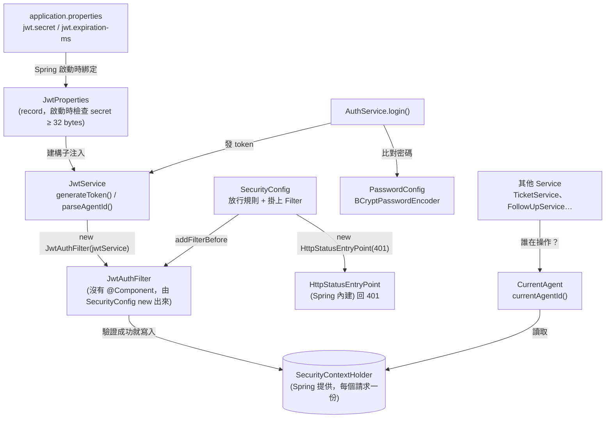
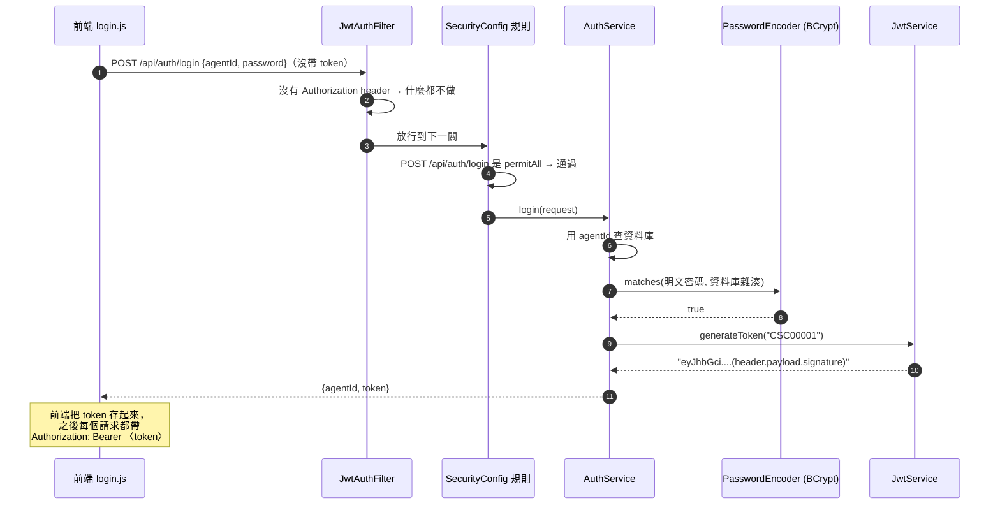
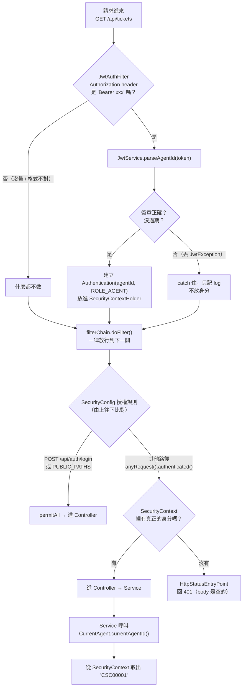
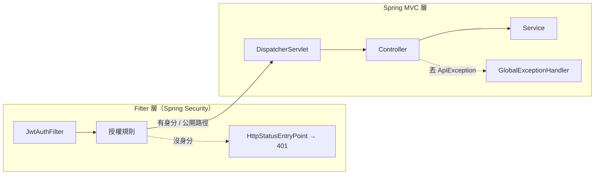
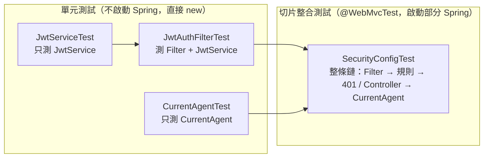

# JWT 登入驗證：security 套件各檔案如何合作

> 對照的程式碼：`src/main/java/com/poz/cs_demo/security/`
> 對照的測試：`src/test/java/com/poz/cs_demo/security/`
> 流程圖使用 Mermaid 語法（IntelliJ、VS Code、GitHub 都能直接顯示）。
> 更完整的先後順序與檔案關聯：[JWT-Security-完整流程圖.md](JWT-Security-完整流程圖.md)

---

## 0. 先用一個生活例子理解

把整個系統想成「有門禁的辦公大樓」：

| 大樓裡的角色 | 程式裡的類別 | 做的事 |
|---|---|---|
| 發門禁卡的櫃台 | `AuthService.login()` + `JwtService.generateToken()` | 確認帳密正確後，發一張「有簽名、有期限」的門禁卡（token） |
| 印卡機的設定（鋼印、有效期） | `JwtProperties` | 從 `application.properties` 讀 `jwt.secret`、`jwt.expiration-ms` |
| 驗卡機 | `JwtService.parseAgentId()` | 檢查卡片簽名是不是我們的、有沒有過期 |
| 門口刷卡的閘門 | `JwtAuthFilter` | 每個人進門都刷一下卡，卡有效就在他身上貼「我是 CSC00001」的名牌 |
| 大樓規章 | `SecurityConfig` | 規定哪些樓層不用卡（大廳、登入櫃台），其他都要有名牌 |
| 警衛 | `HttpStatusEntryPoint`（Spring 內建，在 `SecurityConfig` 設定） | 沒名牌卻要進管制區 → 擋下並回 401 |
| 辦公室裡查名牌的人 | `CurrentAgent` | Service 要知道「現在是誰」時，看一下名牌就知道 |
| 密碼保險箱 | `PasswordConfig` | 提供 BCrypt，用來存密碼雜湊、比對密碼 |

**重點：閘門（Filter）只負責「辨識身分」，不負責擋人；擋人是規章（SecurityConfig）+ 警衛（EntryPoint）的事。**

---

## 1. 檔案之間的依賴關係（誰用到誰）



補充：`JwtProperties` 能被注入，是因為 `CsDemoApplication` 上有 `@ConfigurationPropertiesScan`。

---

## 2. 流程一：登入拿 token



token 裡的 payload 大概長這樣（只是 Base64，**不是加密**，任何人都能解開看）：

```json
{ "sub": "CSC00001", "iat": 1790000000, "exp": 1790028800 }
```

`exp - iat = 28800` 秒 = 8 小時，對應 `jwt.expiration-ms=28800000`。

---

## 3. 流程二：帶 token 呼叫受保護的 API（最核心）

以 `GET /api/tickets` 為例：



### 為什麼 Filter 驗證失敗也「放行」？

因為 Filter 不知道這條路徑需不需要登入。
例如登入頁 `/index.html` 就算帶了過期 token，也應該要能打開。
所以 Filter 只貼名牌、不擋人，**要不要擋交給 SecurityConfig 決定**。

### 為什麼 401 不交給 `GlobalExceptionHandler`？

Security 的擋人發生在 Filter 層，請求還沒進到 Controller，
`@RestControllerAdvice` 根本沒機會出手，所以 401 由 Security 自己的 EntryPoint 回應。
這個專案用 Spring 內建的 `HttpStatusEntryPoint`，只回狀態碼、body 是空的；
前端 `api.js` 只看狀態碼 401 就會清掉 session、跳回登入頁，錯誤訊息則顯示「請求失敗（HTTP 401）」。



---

## 4. SecurityContextHolder 是什麼？（用 Python 對照）

它就像「**每個請求專屬的全域變數**」，底層是 `ThreadLocal`（一個執行緒一份）。

```python
# Python 類比（Flask 的 g 物件概念類似）
import threading
_local = threading.local()

def jwt_filter(request):
    token = request.headers.get("Authorization", "")
    if token.startswith("Bearer "):
        try:
            _local.agent_id = parse_agent_id(token[7:])   # 貼名牌
        except InvalidToken:
            pass                                          # 不貼，但也不擋
    return next_step(request)

def current_agent_id():                                   # 對應 CurrentAgent
    agent_id = getattr(_local, "agent_id", None)
    if agent_id is None:
        raise Unauthorized("尚未登入或登入已失效")
    return agent_id
```

Java 版對應：
- `JwtAuthFilter.setAuthenticated()` → `SecurityContextHolder.setContext(context)`（貼名牌）
- `CurrentAgent.currentAgentId()` → `SecurityContextHolder.getContext().getAuthentication().getName()`（看名牌）

請求結束後 Spring Security 會自動清掉，下一個請求不會拿到上一個人的身分。

---

## 5. 四個測試檔各自在驗證哪一段



由小到大：先確定每顆零件正常，最後再把零件組起來測整條流程。

| 測試檔 | 範圍 | 驗證的重點（測試方法） |
|---|---|---|
| `JwtServiceTest` | 只有 `JwtService` | 產生的 token 有 3 段且能解回同一個 agentId；竄改簽章、換 secret、過期、亂字串 → 都丟 `JwtException` |
| `JwtAuthFilterTest` | `JwtAuthFilter` + `JwtService` | 有效 token → SecurityContext 有 `CSC00001` 與 `ROLE_AGENT`；沒帶 / 非 Bearer / 無效 / 別的 secret → **沒有身分但仍放行、不丟例外** |
| `CurrentAgentTest` | 只有 `CurrentAgent` | 手動塞身分 → 取得 agentId；沒身分、匿名身分（`anonymousUser`）→ 丟 401 的 `ApiException` |
| `SecurityConfigTest` | 整條鏈（用假的 `DummyController`） | 沒帶 token → 401 且 body 是空的；有效 token → 200；無效 / 別的 secret → 401；`/api/whoami` 回傳 token 裡的 agentId；登入端點、靜態資源、Swagger 不會 401 |

### 對照：每個測試案例走的是流程圖的哪條路

用第 3 節的流程圖來看 `SecurityConfigTest`：

| 測試 | Filter 結果 | 規則判斷 | 最終 |
|---|---|---|---|
| `受保護的API_沒帶token_401且body是空的` | 沒 header → 不做事 | `/api/ping` 要登入，沒身分 | HttpStatusEntryPoint → 401 |
| `受保護的API_帶有效token_200` | 解析成功 → 貼名牌 | 有身分 | Controller → 200 |
| `受保護的API_帶無效token_401` | 解析失敗 → catch | 沒身分 | 401 |
| `受保護的API_帶別的secret簽的token_401` | 簽章不符 → catch | 沒身分 | 401 |
| `帶token_CurrentAgent取得的是token裡的agentId` | 貼 `CSC00002` | 有身分 | `CurrentAgent` 讀出 `CSC00002` |
| `登入端點_沒帶token_放行` | 不做事 | `permitAll` | 200 |
| `靜態資源與Swagger_沒帶token_不會是401` | 不做事 | `PUBLIC_PATHS` 放行 | 不是 401（切片測試沒有真的檔案，可能是 404） |

> 小提醒：`SecurityConfigTest` 用 `@WebMvcTest`，它**不會**自動載入 `@Service`、`@ConfigurationProperties`，
> 所以要用 `@Import(...)` 和 `@EnableConfigurationProperties(JwtProperties.class)` 手動把需要的零件帶進來。

---

## 6. 幾個容易卡住的設計細節

1. **`JwtAuthFilter` 為什麼沒有 `@Component`？**
   Spring Boot 會把所有 Filter 型別的 Bean 自動註冊成一般 Servlet Filter，變成在 Security 鏈外面再跑一次。
   所以改在 `SecurityConfig` 裡 `new JwtAuthFilter(jwtService)`，再用 `addFilterBefore` 掛進 Security 的鏈。

2. **為什麼 `CurrentAgent` 要排除 `AnonymousAuthenticationToken`？**
   沒帶 token 時，Spring Security 會自動塞一個叫 `anonymousUser` 的匿名身分，它的 `isAuthenticated()` 也是 `true`，
   只檢查 `null` 會被騙過。

3. **登出為什麼不會讓 token 失效？**
   JWT 是無狀態（STATELESS）的，伺服器沒有記錄發出去的 token，只靠簽章與 `exp` 判斷。
   所以登出只是把狀態改成 OFFLINE，token 在過期前技術上仍然有效（`AuthService` 註解也有說明）。

4. **為什麼關掉 CSRF？**
   CSRF 是防「瀏覽器自動帶 Cookie」的攻擊；JWT 放在 `Authorization` header，瀏覽器不會自動帶，所以不需要。

---

## 7. 一句話總結

```
登入：AuthService 比對密碼 (PasswordConfig) → JwtService 簽發 token
之後每個請求：
  JwtAuthFilter 驗 token（JwtService）→ 成功就寫入 SecurityContext
  → SecurityConfig 規則決定放不放行 → 不放行由 HttpStatusEntryPoint 回 401
  → 放行後 Service 用 CurrentAgent 從 SecurityContext 取出「現在是誰」
```
